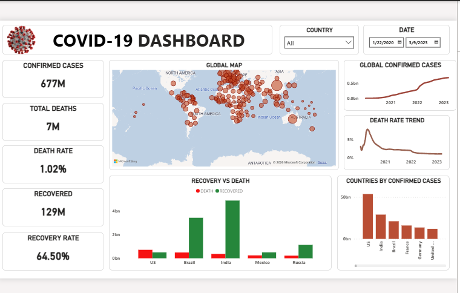

# COVID-19 Global Data Analysis Dashboard

## Project Overview

This project analyzes global COVID-19 data to identify trends in confirmed cases, deaths, recoveries, and active cases across different countries and over time.

The project was created as part of my data analytics learning journey, with a focus on data visualization and dashboard development.

## Tools Used

* Power BI
* Power Query
* DAX
* Excel

## Key KPIs

* Total Confirmed Cases
* Total Deaths
* Total Recovered
* Active Cases
* Mortality Rate
* Recovery Rate
* Daily New Cases
* Daily New Deaths

## Analysis Performed

The dashboard explores COVID-19 trends using interactive visualizations and filters. It allows users to examine the data by country and date and identify patterns in cases, deaths, and recoveries.

## Key Insights

* COVID-19 cases varied significantly across countries.
* Confirmed cases and deaths showed different trends across time.
* Interactive filtering made it easier to compare countries and periods.
* The analysis highlighted the importance of accurate data transformation when building dashboards.

## Project Outcome

This project strengthened my skills in Power BI, data cleaning, data transformation, DAX, and data visualization while improving my ability to communicate analytical findings through an interactive dashboard.

## Dashboard Preview

